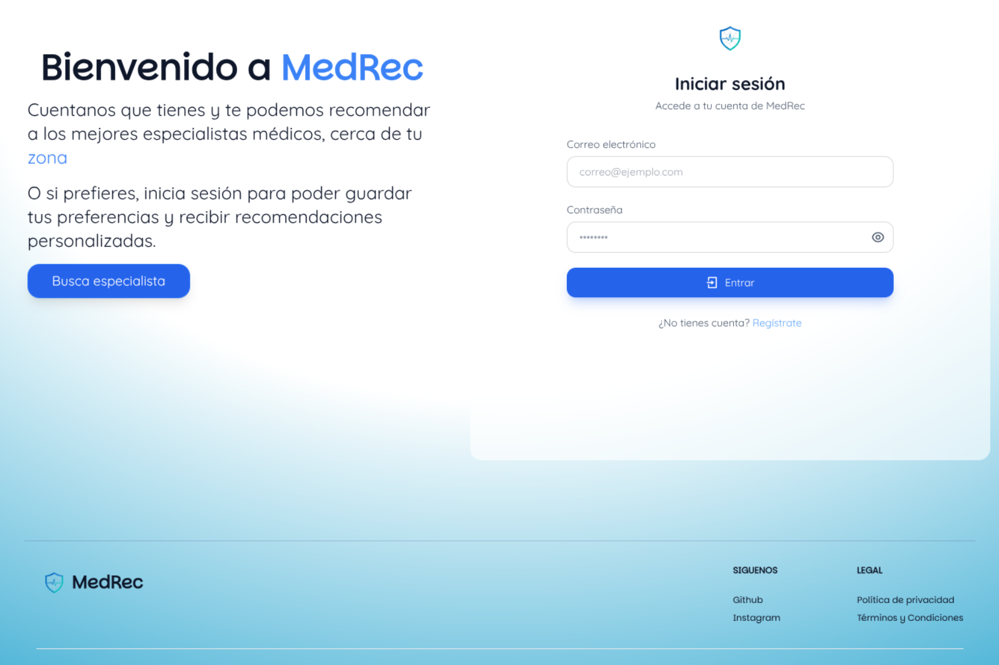
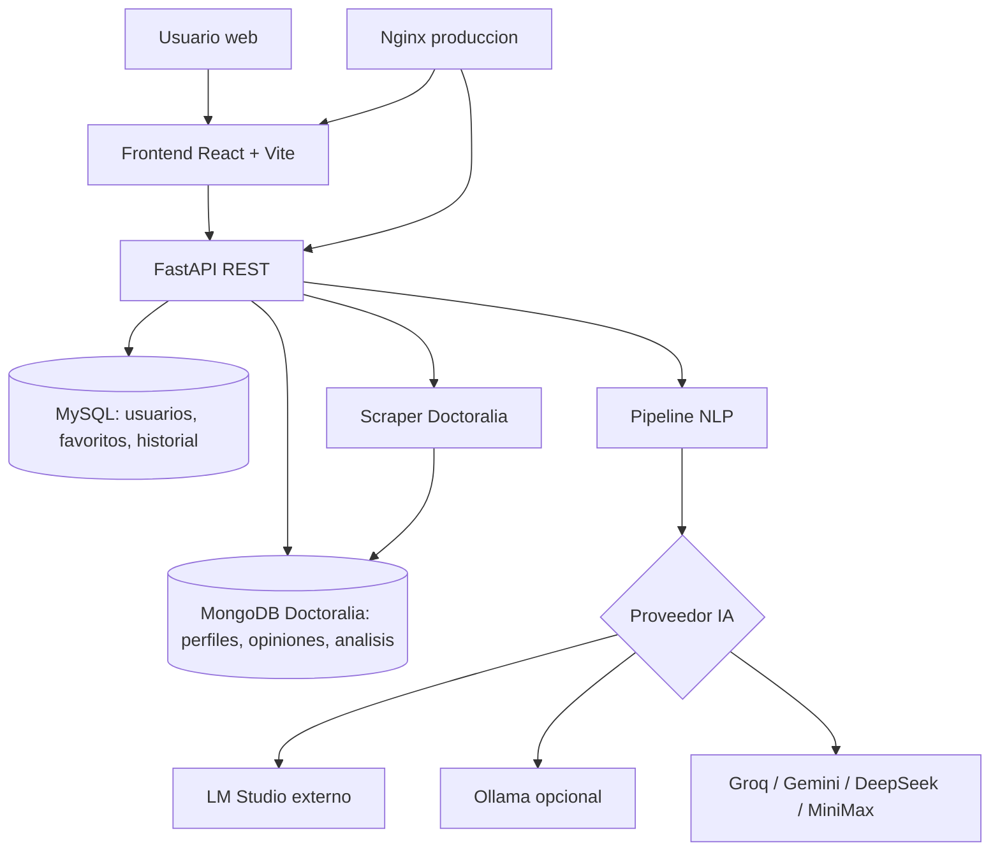

# Plataforma web de recomendación de especialistas médicos mediante procesamiento de lenguaje natural aplicado a reseñas de pacientes en línea (MedRec)

Plataforma web para buscar y recomendar especialistas médicos en México mediante reseñas de pacientes, filtros clínicos, análisis de lenguaje natural e integración con proveedores de IA. 🥼



## ¿Qué hace?

MedRec reúne perfiles médicos obtenidos de Doctoralia, opiniones de pacientes, catálogos de especialidades y ciudades, y análisis generados por modelos LLM. El usuario puede buscar especialistas por especialidad, ciudad, filtros de atención, precio, calificación, cédula, consultorio y confiabilidad del análisis. También incluye autenticación, favoritos, historial, direcciones de usuario, chatbot de búsqueda y herramientas administrativas.

## Stack principal


## Arquitectura



## Datos incluidos

Actualmente el proyecto cuenta con datos scrapeados, almacenados y analizados en MongoDB. Estos registros se encuentran en las copias de base de datos exportadas dentro de `backups/`.

| Información almacenada | Total de documentos |
|---|---:|
| Doctores / Especialistas | 105,268 |
| Opiniones / Reseñas | 4,674,605 |
| Análisis semántico | 105,268 |

Los análisis semánticos fueron generados con distintos modelos de IA:

| Modelo usado | Total que analizó |
|---|---:|
| `qwen2.5:14b` | 98,734 |
| `deepseek` | 6,514 |
| `groq 3` | 18 |
| `gemini` | 2 |

## Documentación 📄

La documentación completa, según se requiera, está en `docs/secciones`.

| Sección | Contenido |
|---|---|
| [Arquitectura](./docs/secciones/arquitectura.md) | Componentes, responsabilidades y flujo general del sistema. |
| [Variables de entorno](./docs/secciones/variables-entorno.md) | Diferencias entre `.env`, `backend/.env` y `backend/.env.prod`. |
| [Arranque y verificación](./docs/secciones/arranque-verificacion.md) | Pasos recomendados para iniciar el proyecto y comprobar que funciona. |
| [Docker](./docs/secciones/docker.md) | Desarrollo, producción, logs, actualización y notas de Ollama/LM Studio. |
| [Carga y respaldo de bases de datos](./docs/secciones/base-datos.md) | Restauración inicial, backups nuevos y comandos para MongoDB/MySQL. |
| [API](./docs/secciones/api/README.md) | Índice de endpoints y módulos disponibles. |
| [Capturas del sistema](./docs/secciones/capturas.md) | Imágenes útiles de ejecución, frontend y servicios externos. |

## Inicio rápido recomendado

> [!IMPORTANT]
> Las copias de seguridad incluidas están ambientadas para restaurarse dentro de contenedores Docker. Para una primera carga completa, primero levanta las bases de datos y copia/restaura los backups dentro de los contenedores antes de usar el frontend.

```bash
# 1. Clonar
git clone --depth 1 --branch v1.0 https://github.com/stbn27/scraper_doctoralia-v2.git
cd scraper_doctoralia-v2

# 2. Preparar variables
cp backend/.env backend/.env.prod

# 3. Levantar bases de datos
docker compose up -d mongodb mysql

# 4. Restaurar backups de MongoDB y MySQL
# Ver comandos completos en docs/secciones/base-datos.md

# 5. Levantar el sistema completo
docker compose up -d

# 6. Verificar
docker compose ps
```

Servicios locales esperados:

| Servicio | URL o puerto |
|---|---|
| Frontend desarrollo | `http://localhost:5173` |
| API FastAPI | `http://localhost:8000` |
| Swagger/OpenAPI | `http://localhost:8000/docs` |
| Health check | `http://localhost:8000/health` |
| MySQL host | `localhost:3310` |
| MongoDB host | `localhost:27017` |

Los comandos documentados están pensados principalmente para Linux. En Windows pueden requerirse equivalencias de PowerShell, Git Bash o WSL.

## Producción 🚀

Para producción se usa `docker-compose.prod.yml`, `backend/Dockerfile.prod`, `frontend/Dockerfile.prod`, Nginx y `backend/.env.prod`.

```bash
docker compose -f docker-compose.prod.yml build
docker compose -f docker-compose.prod.yml up -d
docker compose -f docker-compose.prod.yml ps
```

La guía completa está en [Docker](./docs/secciones/docker.md).

## Código abierto y contribuciones ✏️

Este proyecto es de código abierto. Puedes revisarlo, adaptarlo y proponer mejoras mediante issues o pull requests si encuentras errores, mejoras de documentación, nuevas integraciones, optimizaciones o ajustes de despliegue.

Antes de contribuir, revisa la estructura del proyecto y procura que los cambios sean claros, reproducibles y acompañados de una explicación breve del problema que resuelven.

## Autor

> Esteban Nuñez José Julian 🇲🇽

[](https://www.linkedin.com/in/estebanjose27)
[](http://tiktok.com/@stbn27)
[](https://www.youtube.com/@stbn27)
[](https://github.com/stbn27/stbn27)

Me ayudarías dejando una ⭐ si te gustó el proyecto.
