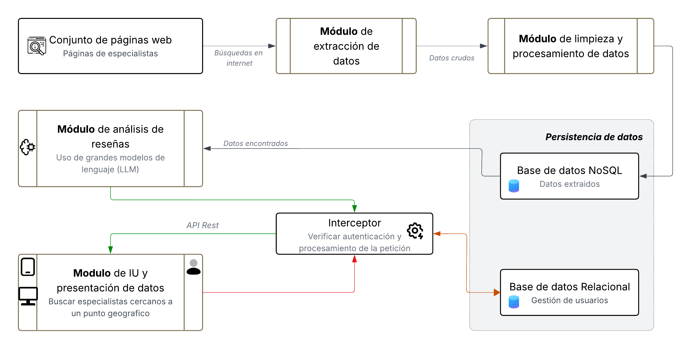
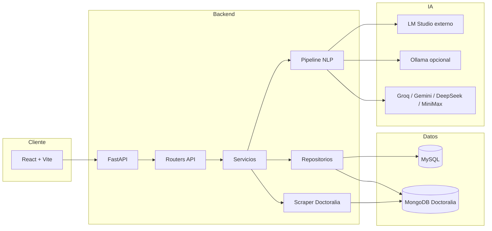
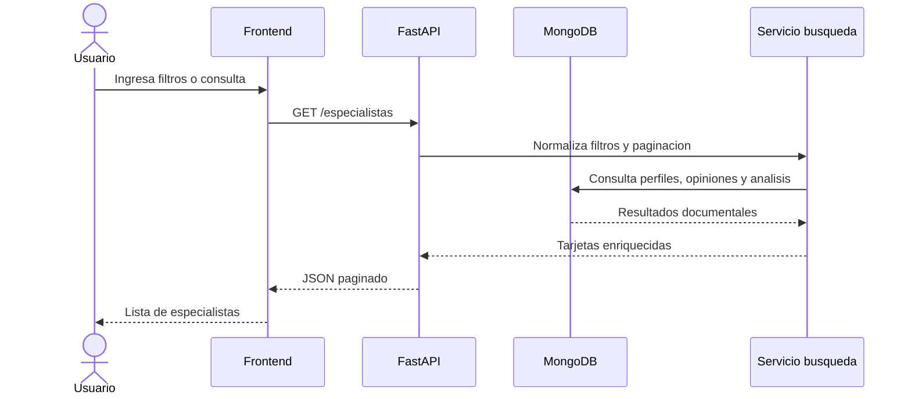
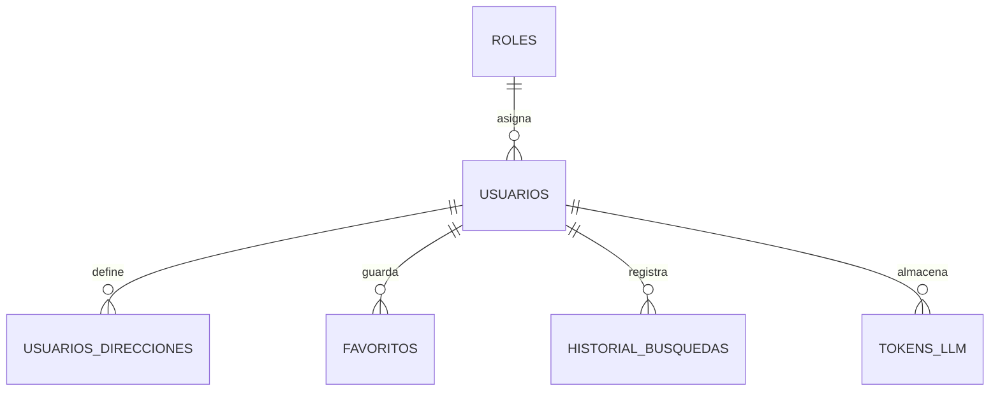

# Arquitectura del sistema

MedRec separa la experiencia de usuario, la API, la persistencia y los procesos de enriquecimiento de datos. El frontend consume una API REST; la API consulta MySQL para identidad y datos de usuario, MongoDB para perfiles médicos, reseñas y análisis, y usa servicios NLP/scraping para generar información adicional.

## Diagrama lógico

## Componentes principales

| Componente | Directorio | Responsabilidad |
|---|---|---|
| Frontend | `frontend/src` | SPA React, rutas públicas, sesión, favoritos, historial, búsqueda y administración. |
| API | `backend/app/api` | Endpoints FastAPI por dominio: usuarios, especialistas, catálogos, chatbot y administración. |
| Servicios | `backend/app/services` | Lógica de negocio reutilizable, búsqueda avanzada, chat y operaciones sobre especialistas. |
| Repositorios | `backend/app/db` | Conexión y consultas a MySQL/MongoDB. |
| NLP | `backend/app/nlp` | Preprocesamiento de opiniones, prompts, selección de modelo y persistencia de análisis. |
| Scraper | `backend/app/scraper` | Extracción de catálogos, listados, perfiles y opiniones desde Doctoralia. |
| Docker | `docker-compose.yml`, `docker-compose.prod.yml` | Orquestación de desarrollo y producción. |

## Flujo de búsqueda

## Persistencia

MySQL guarda información relacional del usuario: roles, cuentas, direcciones, favoritos, historial de búsqueda y tokens LLM. MongoDB Doctoralia guarda información documental: perfiles médicos, opiniones, catálogos de especialidades/ciudades y análisis semánticos.

## Proveedores IA

El sistema puede trabajar con proveedores remotos y locales. LM Studio se ejecuta fuera del `docker-compose` del proyecto y el backend lo consume por HTTP. Ollama es opcional y se activa con perfil Docker cuando existe GPU NVIDIA. Los proveedores remotos dependen de sus API keys.

La selección exacta depende del flujo: el pipeline CLI puede usar `MODELO_ACTIVO` o argumento `--modelo`; el chatbot prioriza proveedores locales disponibles antes de probar proveedores externos configurados.
