# Capturas del sistema

Estas imágenes sirven como apoyo visual para entender el funcionamiento del sistema. Las copias usadas por esta página viven dentro de `docs/secciones/assets` para que la documentación pública sea autocontenida.

## Frontend

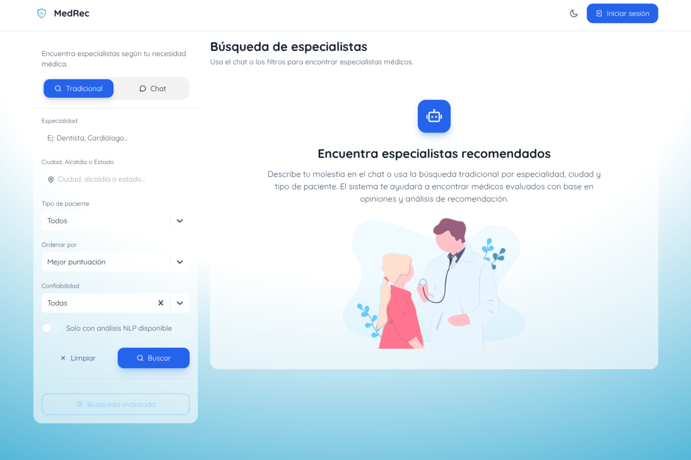

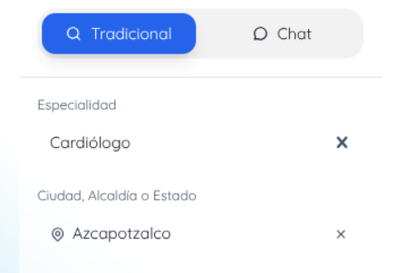

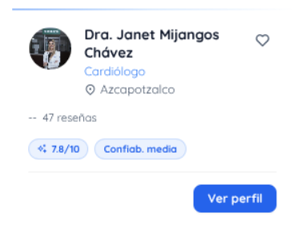

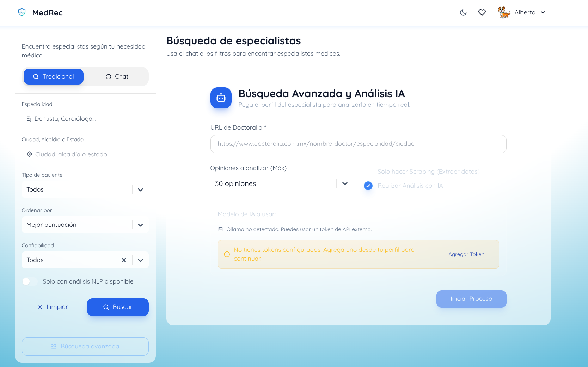

## Chatbot

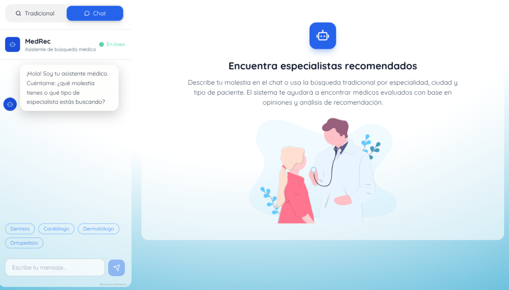

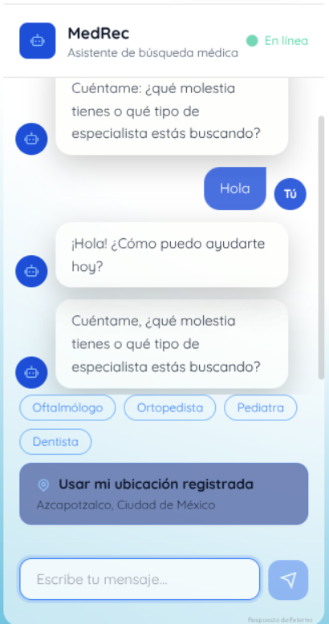

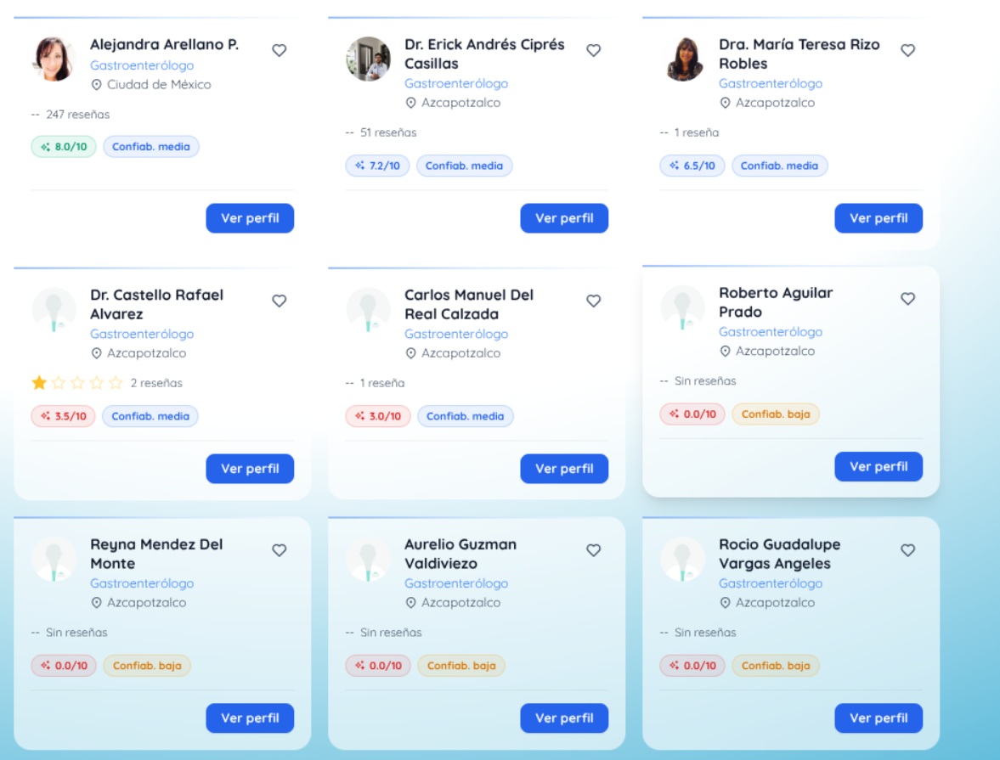

## Administración y verificación

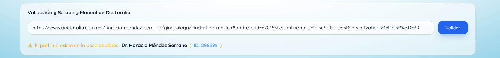

## Servicios externos

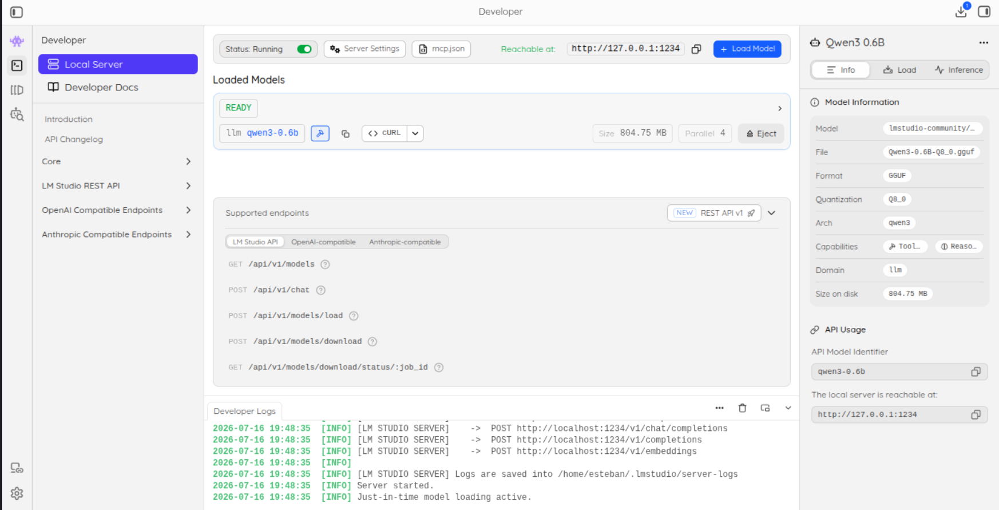

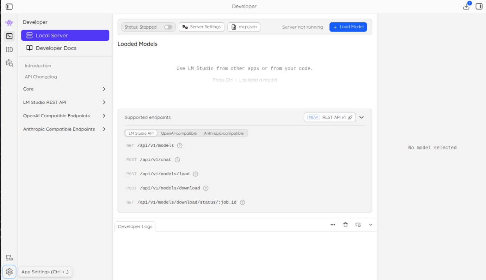

## Doctoralia

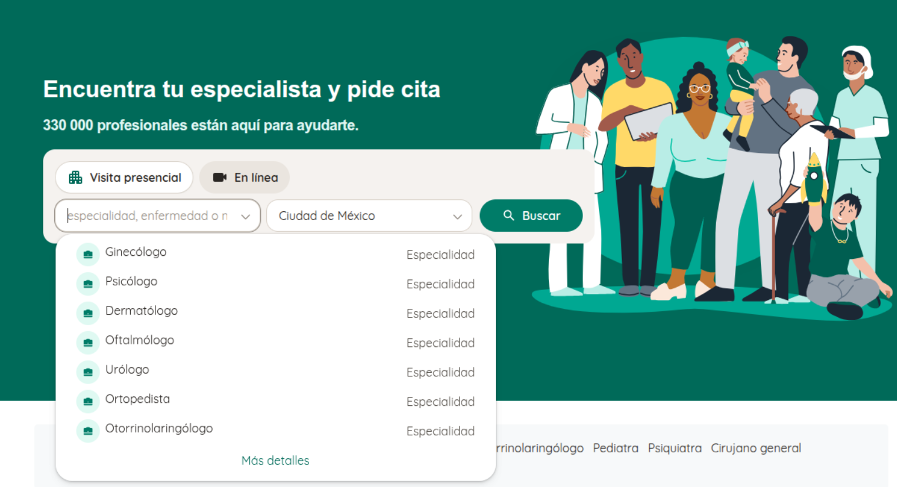

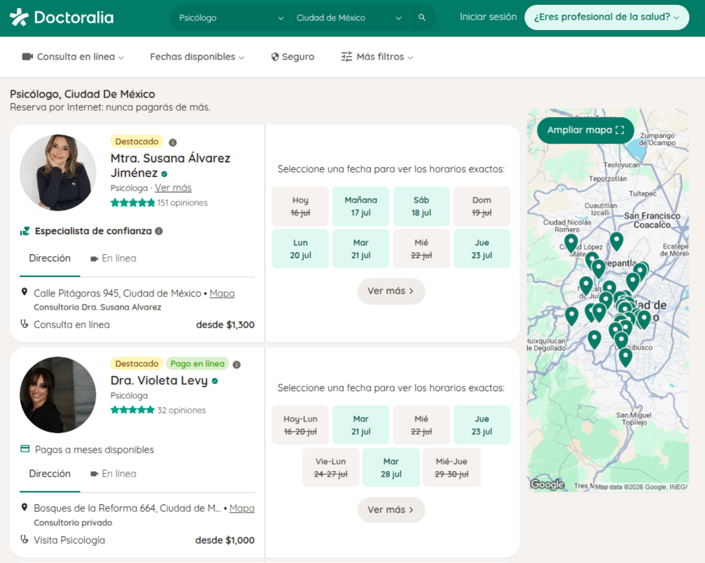
